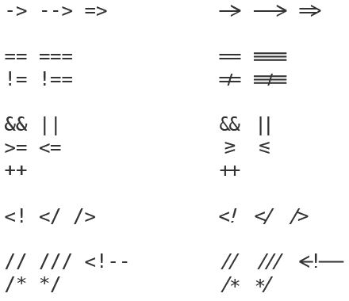
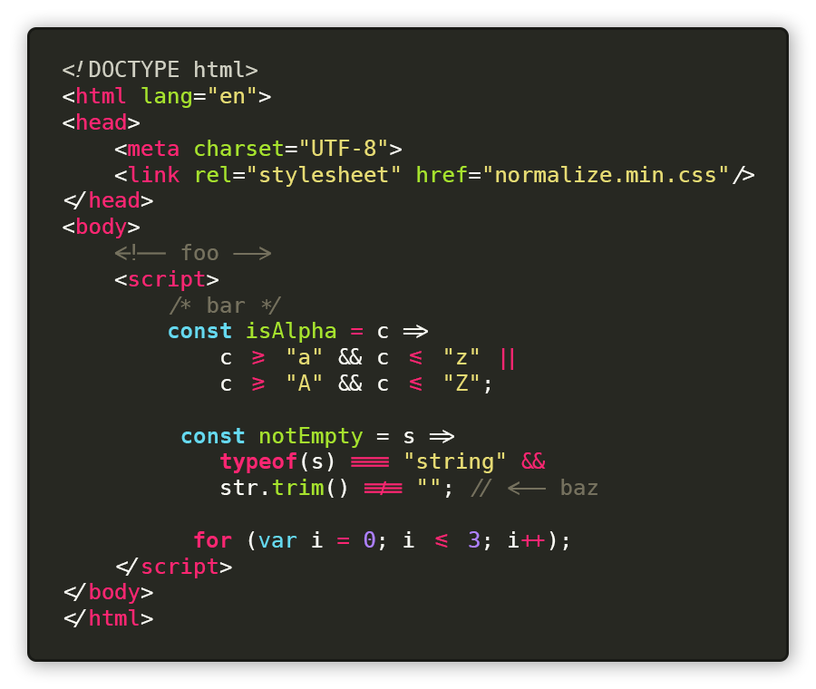

# DejaVu Sans Mono *Code*

[DejaVu Sans Mono](https://dejavu-fonts.github.io/) variant for coding. Features:

* Ligatures
* Powerline support

DejaVu Sans Mono vs DejaVu Sans Mono Code:

In action:

